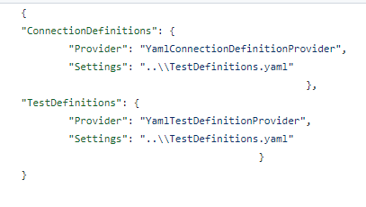
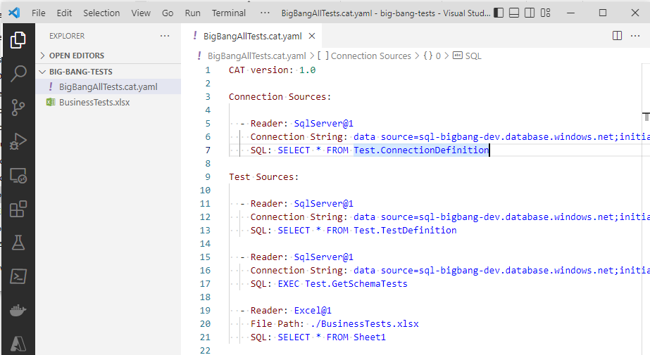

**Welcome to the very first version of CAT - CAT 0.0.1!**



Might not yet be as stable as it's predecessor (JC.Unit), but it brings lots of new stuff ;-) So, what's new?

## Versioning

**ALL** components of CAT will be versioned and released **together**:

- core functionality
- PowerShell module
- GUI (CAT runner) - not yet in this version
- DevOps task - not yet in this version
- documentation
- ...

All will be found on one place (TODO, where), with version specified.

## Project Files

Remember JC.Unit.json file?

Uggly, right? You cannot specify more sources of tests, configuration is not extendable, ...

Welcome to project files:

Note that now you can specify more sources of connections, but what's more important, more sources of tests. It gives you a freedom - organize your tests in one or more YAML files next to your project file, have MS Excel file(s) with tests, get tests from a database - **all of this nicely coupled together, defined on one place - in your project file**.

> The project file must have a file extension `.cat.yaml`.
>
> CAT does NOT understand files with other extensions.

The documentation is not yet ready. Try to mimic what you see in the example on the picture. Contact the development team if needed.

Please see "Migration from JC.Unit" section for instructions how to migrate JC.Unit.json to the new format.

## Readers

TODO

## PowerShell Module

TODO

## Migration from JC.Unit

TODO


This is not a production ready release. Don't migrate the real code. Test it "outside".

