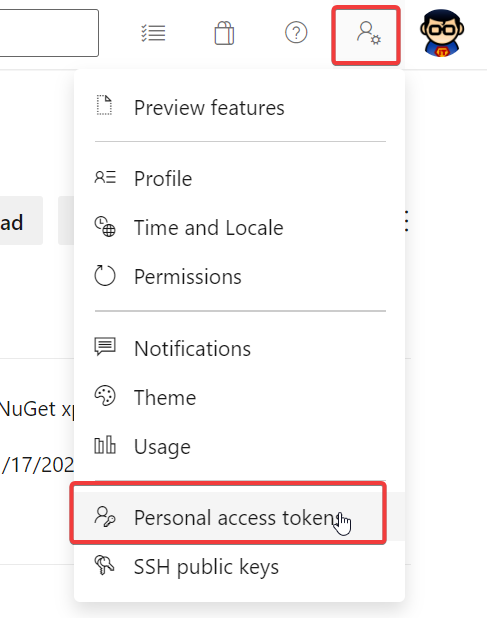
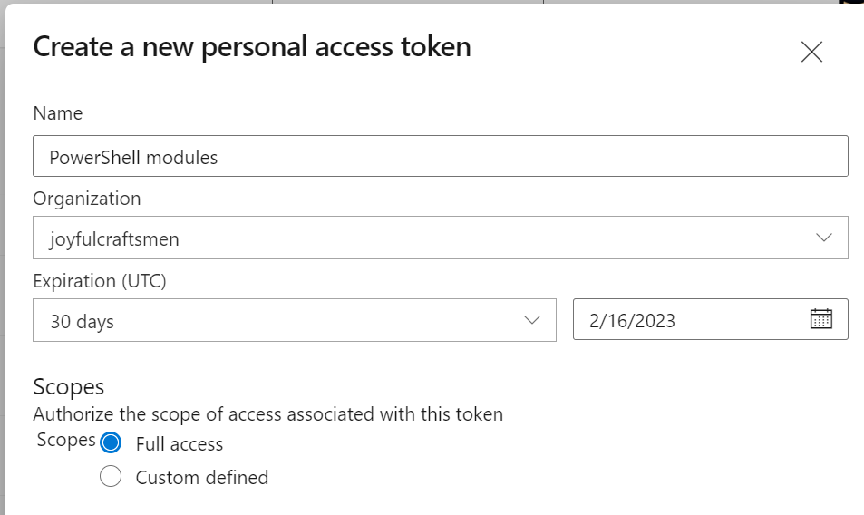

## Install CAT from JC private PowerShell feed

Installation is now much easier and can be done even from Azure DevOps Microsoft hosted agent.

First, you'll need to generate a personal access token. Go to [dev.azure.com](https://dev.azure.com/joyfulcraftsmen) and generate one:



Then, click on "+ New Token" and fill in these values:




Now you can run this script to get CAT. When you are prompted for credentials, fill in your email as user name and **the PAT token** as password - **!! not your domain password !!)**.

```ps1
$credential = Get-Credential
$feedUrl = "https://pkgs.dev.azure.com/joyfulcraftsmen/Products/_packaging/CAT/nuget/v2"
Register-PSRepository -Name JoyfulDevOps -SourceLocation $feedUrl -PublishLocation $feedUrl -InstallationPolicy Trusted -Credential $credential
Install-Module CAT -Repository JoyfulDevOps -Credential $credential -Force -AcceptLicense
```

In Azure DevOps pipelines, the interactive prompt that asks you for credentails does not make sense. In that case, create the `$credential` value like this:

```ps1
$patToken = "$(PatToken)"; # Get PAT token from Azure DevOps sensitive variable
$secure = ConvertTo-SecureString -String $patToken -AsPlainText -Force;
$credential = New-Object System.Management.Automation.PSCredential("your.email@joyfulcraftsmen.com", $secure);
```

Note that you have to change the email in the example above.
