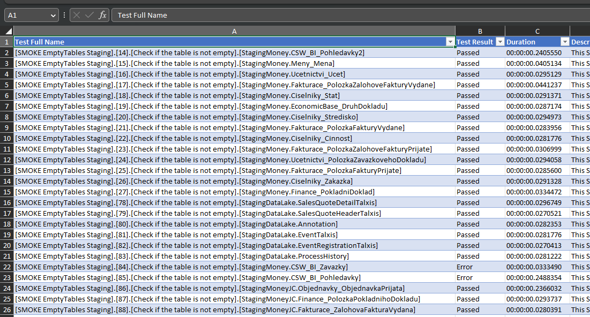

## Output test results in MS Excel

Remember you have more options for storing results of tests?

```yaml
Output: trx, yaml, json
```

Now, there is one more - the always requested .xlsx format:

```yaml
Output: xlsx
```

Use trx for Azure DevOps, json for further automation, xlsx for your users :)




The output defaults to `TestResults` directory with a timestamp in a file name. But if you need more control, you can do the same tricks as with all other formats:

```yaml
Output:
- Format: trx
  Path: LatestResults.trx
- Format: json
  Path: result-{timestamp}.json
```

The first example always rewrites the LatestResults.trx file with current content. The other creates a result....json file in the projects directory (not in TestResults directory as in default configuration). Boht absolute and relative paths work, relative paths resolve against the folder where you have your *.cat.yaml project file.

